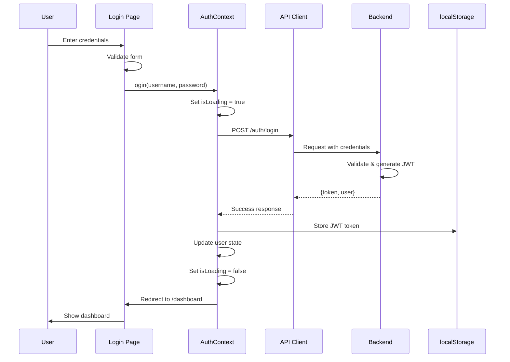
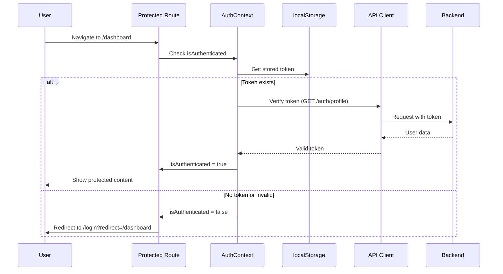
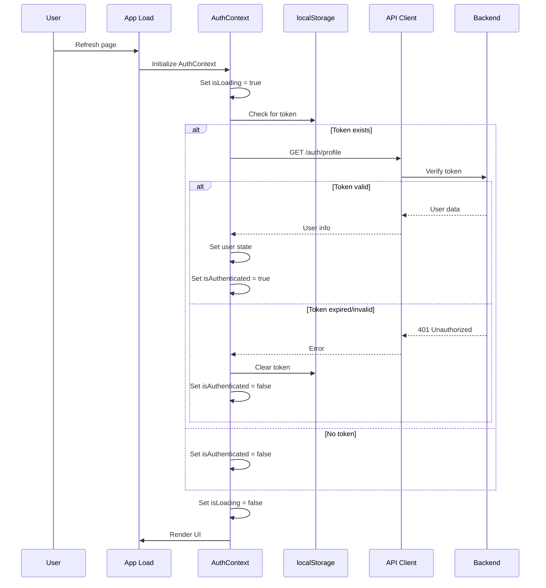

# Design Document - Authentication System

## Overview

The Authentication System provides secure user authentication and authorization for the PrimeAcc application, integrating the Next.js 15 (App Router) frontend with the existing NestJS backend. The system follows established patterns from the codebase, particularly the ThemeContext implementation, to ensure consistency and maintainability.

### Key Design Principles

1. **Security First**: Implement industry-standard security practices including JWT token management, XSS prevention, CSRF protection, and secure token storage
2. **Seamless Integration**: Follow existing patterns (ThemeContext, glassmorphism UI, Navy theme) for consistency
3. **User Experience**: Provide clear feedback, loading states, and error messages throughout the authentication flow
4. **Accessibility**: Ensure WCAG AA compliance with proper ARIA labels, keyboard navigation, and screen reader support
5. **Type Safety**: Leverage TypeScript for compile-time safety and better developer experience

### System Boundaries

**In Scope:**
- User registration and login UI components
- JWT token management and storage
- Protected route implementation
- Authentication state management via React Context
- Session persistence across page refreshes
- Role-based access control (MEMBER, AGENT, ADMIN)
- Form validation and error handling
- Integration with existing backend endpoints

**Out of Scope:**
- Backend authentication logic (already implemented)
- Password reset functionality (future enhancement)
- Two-factor authentication (future enhancement)
- OAuth provider implementation (GitHub, Google buttons are UI placeholders)
- Email verification workflow

## Architecture

### High-Level Architecture

```mermaid
graph TB
    subgraph "Frontend - Next.js 15 App Router"
        A[Login Page] --> B[AuthContext]
        C[Register Page] --> B
        D[Protected Routes] --> B
        E[Dashboard Pages] --> D
        B --> F[API Client]
        F --> G[HTTP Interceptor]
    end
    
    subgraph "Backend - NestJS"
        H[Auth Controller]
        I[Auth Service]
        J[JWT Strategy]
        K[Prisma Database]
    end
    
    G -->|POST /auth/login| H
    G -->|POST /auth/register| H
    G -->|GET /auth/profile| H
    H --> I
    I --> J
    I --> K
    
    subgraph "Storage"
        L[localStorage - JWT Token]
        M[Memory - User State]
    end
    
    B --> L
    B --> M
    
    style B fill:#8B5CF6
    style F fill:#F59E0B
    style H fill:#0F172A
```



### Component Hierarchy

```
app/
├── layout.tsx (Root Layout with AuthProvider)
├── (auth)/
│   ├── login/
│   │   └── page.tsx (Login Page)
│   └── register/
│       └── page.tsx (Register Page)
└── dashboard/
    ├── layout.tsx (Protected Layout)
    └── [...pages]

contexts/
└── AuthContext.tsx (Authentication State Management)

components/
├── auth/
│   ├── LoginForm.tsx
│   ├── RegisterForm.tsx
│   ├── ProtectedRoute.tsx
│   └── AuthLoadingSpinner.tsx
└── [...existing components]

lib/
├── api/
│   ├── client.ts (HTTP Client with interceptors)
│   └── auth.ts (Auth API functions)
├── auth/
│   ├── token.ts (Token storage utilities)
│   └── validation.ts (Form validation)
└── utils.ts (Existing utilities)

types/
└── auth.ts (TypeScript interfaces)
```

### Data Flow

#### Login Flow



#### Protected Route Flow



#### Session Persistence Flow



## Components and Interfaces

### Core Components

#### 1. AuthContext Provider

**Purpose**: Centralized authentication state management following ThemeContext pattern

**Location**: `frontend/src/contexts/AuthContext.tsx`

**Interface**:
```typescript
interface User {
  id: string;
  username: string;
  email: string;
  role: 'MEMBER' | 'AGENT' | 'ADMIN';
}

interface AuthContextType {
  // State
  user: User | null;
  isAuthenticated: boolean;
  isLoading: boolean;
  error: string | null;
  
  // Actions
  login: (username: string, password: string) => Promise<void>;
  register: (username: string, email: string, password: string) => Promise<void>;
  logout: () => void;
  clearError: () => void;
  
  // Role helpers
  hasRole: (role: User['role']) => boolean;
  isAdmin: boolean;
  isAgent: boolean;
  isMember: boolean;
}
```

**Key Features**:
- Automatic token verification on mount
- Session persistence via localStorage
- Error state management
- Loading state for async operations
- Role-based helper functions

#### 2. ProtectedRoute Component

**Purpose**: Wrapper component that enforces authentication for protected pages

**Location**: `frontend/src/components/auth/ProtectedRoute.tsx`

**Props**:
```typescript
interface ProtectedRouteProps {
  children: React.ReactNode;
  requiredRole?: User['role'];
  fallback?: React.ReactNode;
}
```

**Behavior**:
- Shows loading spinner while checking authentication
- Redirects to `/login?redirect={currentPath}` if unauthenticated
- Redirects to `/dashboard` with error message if role insufficient
- Renders children if authenticated and authorized

#### 3. LoginForm Component

**Purpose**: User login interface with validation and error handling

**Location**: `frontend/src/components/auth/LoginForm.tsx`

**Features**:
- Real-time form validation
- Password visibility toggle
- Loading state with disabled inputs
- Error message display
- Remember me checkbox (UI only, session handled by token expiry)
- Responsive design matching Navy theme

#### 4. RegisterForm Component

**Purpose**: User registration interface with comprehensive validation

**Location**: `frontend/src/components/auth/RegisterForm.tsx`

**Features**:
- Multi-field validation (username, email, password, confirm password)
- Password strength indicator
- Real-time validation feedback with debouncing
- Visual indicators (checkmarks for valid, X for invalid)
- Submit button disabled until all fields valid
- Error handling for backend validation errors

#### 5. AuthLoadingSpinner Component

**Purpose**: Full-page loading indicator during authentication checks

**Location**: `frontend/src/components/auth/AuthLoadingSpinner.tsx`

**Features**:
- Centered spinner with Navy theme colors
- Prevents flash of unauthenticated content
- Consistent with existing loading patterns

### API Client Layer

#### HTTP Client Configuration

**Location**: `frontend/src/lib/api/client.ts`

```typescript
interface ApiClientConfig {
  baseURL: string;
  timeout: number;
  withCredentials: boolean;
}

class ApiClient {
  private baseURL: string;
  
  constructor(config: ApiClientConfig);
  
  // Request interceptor - adds JWT token
  private addAuthHeader(config: RequestConfig): RequestConfig;
  
  // Response interceptor - handles 401 errors
  private handleUnauthorized(error: ApiError): void;
  
  // HTTP methods
  get<T>(url: string, config?: RequestConfig): Promise<T>;
  post<T>(url: string, data: any, config?: RequestConfig): Promise<T>;
  put<T>(url: string, data: any, config?: RequestConfig): Promise<T>;
  delete<T>(url: string, config?: RequestConfig): Promise<T>;
}
```

**Key Features**:
- Automatic JWT token injection in Authorization header
- Global error handling for 401 Unauthorized
- Request/response interceptors
- TypeScript generics for type-safe responses
- Environment-based base URL configuration

#### Auth API Functions

**Location**: `frontend/src/lib/api/auth.ts`

```typescript
interface LoginRequest {
  username: string;
  password: string;
}

interface LoginResponse {
  token: string;
  user: {
    id: string;
    username: string;
    email: string;
    role: 'MEMBER' | 'AGENT' | 'ADMIN';
  };
}

interface RegisterRequest {
  username: string;
  email: string;
  password: string;
}

interface RegisterResponse {
  message: string;
  user: {
    id: string;
    username: string;
    email: string;
  };
}

// API functions
export const authApi = {
  login: (data: LoginRequest): Promise<LoginResponse>;
  register: (data: RegisterRequest): Promise<RegisterResponse>;
  getProfile: (): Promise<User>;
  logout: (): Promise<void>;
};
```

### Utility Modules

#### Token Management

**Location**: `frontend/src/lib/auth/token.ts`

```typescript
export const tokenStorage = {
  // Store JWT token
  setToken: (token: string): void;
  
  // Retrieve JWT token
  getToken: (): string | null;
  
  // Remove JWT token
  removeToken: (): void;
  
  // Decode JWT token (without verification)
  decodeToken: (token: string): DecodedToken | null;
  
  // Check if token is expired
  isTokenExpired: (token: string): boolean;
  
  // Sanitize token to prevent XSS
  sanitizeToken: (token: string): string;
};
```

**Security Considerations**:
- Uses localStorage (httpOnly cookies preferred but requires backend support)
- Sanitizes token values before storage
- Never logs token values
- Clears token on logout and expiration

#### Form Validation

**Location**: `frontend/src/lib/auth/validation.ts`

```typescript
interface ValidationResult {
  isValid: boolean;
  error?: string;
}

interface PasswordStrength {
  score: 0 | 1 | 2 | 3; // weak, medium, strong, very strong
  feedback: string[];
  hasUppercase: boolean;
  hasLowercase: boolean;
  hasNumber: boolean;
  hasSpecial: boolean;
  meetsLength: boolean;
}

export const validators = {
  // Username: 3-20 alphanumeric characters
  validateUsername: (username: string): ValidationResult;
  
  // Email: RFC 5322 format
  validateEmail: (email: string): ValidationResult;
  
  // Password: min 8 chars, 1 upper, 1 lower, 1 number, 1 special
  validatePassword: (password: string): ValidationResult;
  
  // Password strength analysis
  getPasswordStrength: (password: string): PasswordStrength;
  
  // Confirm password match
  validatePasswordMatch: (password: string, confirm: string): ValidationResult;
  
  // Sanitize input to prevent XSS
  sanitizeInput: (input: string): string;
};
```

## Data Models

### TypeScript Interfaces

**Location**: `frontend/src/types/auth.ts`

```typescript
// User model
export interface User {
  id: string;
  username: string;
  email: string;
  role: UserRole;
  createdAt?: string;
  updatedAt?: string;
}

// User roles
export type UserRole = 'MEMBER' | 'AGENT' | 'ADMIN';

// Authentication state
export interface AuthState {
  user: User | null;
  isAuthenticated: boolean;
  isLoading: boolean;
  error: string | null;
}

// JWT token payload (decoded)
export interface DecodedToken {
  sub: string; // user id
  username: string;
  email: string;
  role: UserRole;
  iat: number; // issued at
  exp: number; // expiration
}

// API request/response types
export interface LoginCredentials {
  username: string;
  password: string;
}

export interface RegisterData {
  username: string;
  email: string;
  password: string;
}

export interface AuthResponse {
  token: string;
  user: User;
}

export interface ApiError {
  message: string;
  statusCode: number;
  errors?: Record<string, string[]>; // Field-specific validation errors
}

// Form state
export interface LoginFormState {
  username: string;
  password: string;
  rememberMe: boolean;
}

export interface RegisterFormState {
  username: string;
  email: string;
  password: string;
  confirmPassword: string;
}

// Validation state
export interface FieldValidation {
  value: string;
  isValid: boolean;
  error: string | null;
  isTouched: boolean;
}

export interface FormValidation {
  [key: string]: FieldValidation;
}
```

### State Management Structure

```typescript
// AuthContext internal state
interface AuthContextState {
  // User data
  user: User | null;
  
  // Authentication status
  isAuthenticated: boolean;
  
  // Loading states
  isLoading: boolean;        // Initial auth check
  isLoginLoading: boolean;   // Login in progress
  isRegisterLoading: boolean; // Registration in progress
  
  // Error handling
  error: string | null;
  
  // Rate limiting (client-side)
  loginAttempts: number;
  lastLoginAttempt: number | null;
}
```

### Local Storage Schema

```typescript
// localStorage keys
const STORAGE_KEYS = {
  AUTH_TOKEN: 'primeacc_auth_token',
  THEME: 'theme',           // Existing
  COLOR_THEME: 'colorTheme' // Existing
};

// Stored token format
interface StoredToken {
  token: string;
  expiresAt: number; // Unix timestamp
}
```


## Correctness Properties

*A property is a characteristic or behavior that should hold true across all valid executions of a system—essentially, a formal statement about what the system should do. Properties serve as the bridge between human-readable specifications and machine-verifiable correctness guarantees.*

### Property Reflection

After analyzing all acceptance criteria, I identified the following redundancies and consolidations:

**Redundancies Eliminated:**
- Properties 6.2, 6.3, 6.4, and 11.6 all test logout cleanup → Consolidated into single comprehensive logout property
- Properties 1.8 and 2.9 both test loading states during async operations → Consolidated into single loading state property
- Properties 7.2-7.7 all test AuthContext API shape → Consolidated into single API interface property
- Properties 3.1 and 3.6 both relate to token storage → Combined into secure token storage property
- Properties 5.2 and 5.3 both test token decoding and state population → Combined into single property

**Properties Combined:**
- All validation properties (1.2, 1.3, 1.4, 2.2) → Consolidated into input validation property
- All error handling properties (8.1, 8.5, 8.6) → Consolidated into error handling property
- All accessibility properties (14.1, 14.4, 14.5, 14.6, 14.8) → Consolidated into accessibility compliance property

### Property 1: Input Validation

*For any* user input (username, email, password), the validation function should correctly accept valid inputs and reject invalid inputs according to the specified rules: username 3-20 alphanumeric characters, email RFC 5322 format, password minimum 8 characters with uppercase, lowercase, number, and special character.

**Validates: Requirements 1.2, 1.3, 1.4, 2.2**

### Property 2: XSS Prevention Through Sanitization

*For any* user input containing potential XSS payloads (script tags, event handlers, malicious HTML), the sanitization function should remove or escape dangerous content before storage or transmission to the backend.

**Validates: Requirements 11.1, 3.6**

### Property 3: API Request Format Consistency

*For any* authentication API call (login, register), the request should include Content-Type: application/json header, correct endpoint path, and properly formatted JSON payload matching the expected schema.

**Validates: Requirements 1.5, 2.3, 15.1, 15.2**

### Property 4: Token Storage and Retrieval Round Trip

*For any* valid JWT token, storing the token and then retrieving it should return the same token value (sanitized), and the token should be automatically included in subsequent authenticated API requests as "Bearer {token}" in the Authorization header.

**Validates: Requirements 2.4, 3.1, 3.2, 3.6**

### Property 5: Authentication State Consistency

*For any* successful login response containing user data, the AuthContext should be updated with the user information (username, email, role), isAuthenticated should be true, and the token should be stored in localStorage.

**Validates: Requirements 2.5, 12.1**

### Property 6: Protected Route Access Control

*For any* route under /dashboard/*, an unauthenticated user should be redirected to /login with the original destination preserved as a query parameter, and after successful login, should be redirected back to the original destination.

**Validates: Requirements 4.1, 4.2, 4.3**

### Property 7: Token Expiration Handling

*For any* expired or invalid JWT token, the system should clear the token from storage, reset AuthContext to unauthenticated state, and redirect to the login page.

**Validates: Requirements 3.3, 3.4, 5.4**

### Property 8: Session Persistence on Page Load

*For any* valid token in localStorage, when the application loads, the system should verify the token with the backend, decode it to extract user information, and populate AuthContext with the user data if valid.

**Validates: Requirements 5.1, 5.2, 5.3, 5.5**

### Property 9: Logout Cleanup Completeness

*For any* authenticated user, when logout is triggered, the system should clear the JWT token from localStorage, reset all user data in AuthContext (user = null, isAuthenticated = false), and clear any cached user data from memory.

**Validates: Requirements 6.2, 6.3, 6.4, 11.6**

### Property 10: Loading State During Async Operations

*For any* authentication operation (login, register, token verification), while the operation is pending, the system should set isLoading to true, display a loading indicator, and disable all form inputs and buttons until the operation completes.

**Validates: Requirements 1.8, 2.9, 9.4**

### Property 11: Error Handling and Display

*For any* API error response, the system should display an appropriate error message to the user, log the error to the console for debugging, and clear the error message when the user starts typing in any form field.

**Validates: Requirements 1.7, 8.1, 8.5, 8.6**

### Property 12: HTTP Status Code Handling

*For any* backend API response, the system should handle different status codes appropriately: 200 (success), 400 (validation error with field-specific messages), 401 (unauthorized with auth reset), 429 (rate limit message), 500 (generic error message).

**Validates: Requirements 15.4**

### Property 13: Role-Based Access Control

*For any* user with a specific role (MEMBER, AGENT, ADMIN), the hasRole function should correctly return true for that role and false for others, and components requiring specific roles should conditionally render based on the user's role.

**Validates: Requirements 12.3, 12.4**

### Property 14: Password Strength Calculation

*For any* password string, the password strength function should correctly calculate the strength score (weak, medium, strong) based on the presence of uppercase, lowercase, numbers, special characters, and length, and provide specific feedback for missing requirements.

**Validates: Requirements 13.2, 13.3**

### Property 15: Password Confirmation Validation

*For any* pair of password and confirm password inputs, the validation should return an error if they don't match and success if they match exactly.

**Validates: Requirements 13.5**

### Property 16: Form Validation State Management

*For any* form with required fields, the submit button should be disabled when any field is invalid, and enabled only when all required fields pass validation.

**Validates: Requirements 13.7**

### Property 17: Debounced Validation Timing

*For any* input field with debounced validation (email), the validation function should not be called immediately on input change, but should be called after 500ms of inactivity.

**Validates: Requirements 13.1**

### Property 18: Client-Side Rate Limiting

*For any* sequence of login attempts, after 5 failed attempts within 60 seconds, subsequent login attempts should be blocked with an appropriate error message until the time window expires.

**Validates: Requirements 11.5**

### Property 19: Authenticated User Redirect from Auth Pages

*For any* authenticated user attempting to access /login or /register routes, the system should redirect them to /dashboard instead of showing the auth pages.

**Validates: Requirements 4.6**

### Property 20: Role-Based Route Authorization

*For any* route requiring a specific role, when a user with insufficient privileges attempts to access it, the system should redirect to /dashboard with an "Access denied" message.

**Validates: Requirements 12.5**

### Property 21: Theme Integration

*For any* theme change (light/dark mode), the authentication pages should apply the correct theme classes and maintain visual consistency with the rest of the application.

**Validates: Requirements 10.7**

### Property 22: Accessibility Compliance

*For any* form input, button, or interactive element, the component should include proper ARIA labels, use semantic HTML elements (form, label, button), ensure labels are associated with inputs via htmlFor, provide alt text for icons, and use ARIA live regions for error announcements.

**Validates: Requirements 14.1, 14.4, 14.5, 14.6, 14.8**

### Property 23: Reduced Motion Support

*For any* user with prefers-reduced-motion preference enabled, animations and transitions in the authentication system should be disabled or minimized.

**Validates: Requirements 14.7**

### Property 24: Request Timeout Handling

*For any* authentication operation that exceeds 10 seconds, the system should display a timeout error message and reset the loading state.

**Validates: Requirements 9.6**

### Property 25: API Response Parsing

*For any* successful authentication response from the backend, the system should correctly parse the JWT token and user data from the expected format { token: string, user: { username, email, role } }.

**Validates: Requirements 15.3**

### Property 26: Environment Configuration

*For any* API request, the base URL should be read from the NEXT_PUBLIC_API_URL environment variable, allowing different configurations for development, staging, and production.

**Validates: Requirements 15.5**

### Property 27: Credentials Inclusion in Requests

*For any* API request when using cookie-based authentication, the request should include credentials: 'include' to ensure cookies are sent with cross-origin requests.

**Validates: Requirements 15.6**

### Property 28: Password Security

*For any* password value in the system, it should never appear in console logs, error messages, or be displayed in plain text in the DOM (except when explicitly toggled by the user).

**Validates: Requirements 11.3**

## Error Handling

### Error Categories and Strategies

#### 1. Network Errors

**Scenarios:**
- No internet connection
- Backend server unreachable
- Request timeout (>10 seconds)
- CORS issues

**Handling Strategy:**
```typescript
try {
  const response = await fetch(url, config);
} catch (error) {
  if (error instanceof TypeError) {
    // Network error or CORS issue
    setError("Network error. Please check your connection and try again");
  } else if (error.name === 'AbortError') {
    // Request timeout
    setError("Request timed out. Please try again");
  }
  console.error('Network error:', error);
}
```

**User Experience:**
- Display user-friendly error message
- Provide retry button
- Log technical details to console
- Don't expose technical error details to users

#### 2. Authentication Errors

**Scenarios:**
- Invalid credentials (401)
- Token expired (401)
- Rate limiting (429)
- Account locked/disabled

**Handling Strategy:**
```typescript
if (response.status === 401) {
  // Clear auth state
  tokenStorage.removeToken();
  setUser(null);
  setIsAuthenticated(false);
  
  // Redirect to login with message
  router.push('/login?error=session_expired');
}

if (response.status === 429) {
  setError("Too many login attempts. Please try again later");
  // Implement exponential backoff
}
```

**User Experience:**
- Clear, specific error messages
- Automatic redirect to login when session expires
- Preserve user's intended destination
- Show remaining time for rate limit

#### 3. Validation Errors

**Scenarios:**
- Client-side validation failures
- Server-side validation errors (400)
- Field-specific errors

**Handling Strategy:**
```typescript
interface ValidationError {
  field: string;
  message: string;
}

if (response.status === 400) {
  const data = await response.json();
  
  // Handle field-specific errors
  if (data.errors) {
    Object.entries(data.errors).forEach(([field, messages]) => {
      setFieldError(field, messages[0]);
    });
  } else {
    setError(data.message);
  }
}
```

**User Experience:**
- Show errors below specific fields
- Real-time validation feedback
- Clear errors when user starts typing
- Visual indicators (red border, error icon)

#### 4. Server Errors

**Scenarios:**
- Internal server error (500)
- Service unavailable (503)
- Bad gateway (502)

**Handling Strategy:**
```typescript
if (response.status >= 500) {
  setError("An unexpected error occurred. Please try again");
  
  // Log for debugging
  console.error('Server error:', {
    status: response.status,
    url: response.url,
    timestamp: new Date().toISOString()
  });
  
  // Optional: Send to error tracking service
  // errorTracker.captureException(error);
}
```

**User Experience:**
- Generic error message (don't expose server details)
- Suggest trying again later
- Provide support contact if error persists
- Log details for debugging

#### 5. Token Management Errors

**Scenarios:**
- Token decode failure
- Token storage failure
- Token missing from response

**Handling Strategy:**
```typescript
try {
  const decoded = tokenStorage.decodeToken(token);
  if (!decoded || tokenStorage.isTokenExpired(token)) {
    throw new Error('Invalid or expired token');
  }
} catch (error) {
  // Clear invalid token
  tokenStorage.removeToken();
  setIsAuthenticated(false);
  
  // Redirect to login
  router.push('/login?error=invalid_session');
}
```

**User Experience:**
- Automatic cleanup of invalid tokens
- Seamless redirect to login
- Preserve user's intended destination
- Clear session expired message

### Global Error Boundary

Implement a React Error Boundary to catch unexpected errors:

```typescript
class AuthErrorBoundary extends React.Component {
  componentDidCatch(error: Error, errorInfo: React.ErrorInfo) {
    console.error('Auth error boundary caught:', error, errorInfo);
    
    // Clear auth state if error is auth-related
    if (error.message.includes('auth') || error.message.includes('token')) {
      tokenStorage.removeToken();
    }
  }
  
  render() {
    if (this.state.hasError) {
      return (
        <div className="error-fallback">
          <h2>Something went wrong</h2>
          <button onClick={() => window.location.href = '/login'}>
            Return to Login
          </button>
        </div>
      );
    }
    
    return this.props.children;
  }
}
```

### Error Logging Strategy

**Development:**
- Log all errors to console with full details
- Include stack traces
- Show error details in UI for debugging

**Production:**
- Log errors to console (users can report)
- Send critical errors to monitoring service
- Show user-friendly messages only
- Never expose sensitive data in logs

## Testing Strategy

### Dual Testing Approach

The authentication system requires both unit tests and property-based tests to ensure comprehensive coverage:

**Unit Tests** focus on:
- Specific examples and edge cases
- Integration points between components
- Error conditions and boundary cases
- UI component rendering and interactions

**Property-Based Tests** focus on:
- Universal properties that hold for all inputs
- Comprehensive input coverage through randomization
- Validation logic across many generated inputs
- State management consistency

Together, these approaches provide complete coverage: unit tests catch concrete bugs and verify specific behaviors, while property tests verify general correctness across a wide range of inputs.

### Property-Based Testing Configuration

**Library Selection:**
- **Frontend**: Use `fast-check` for TypeScript/React property-based testing
- **Why fast-check**: Native TypeScript support, excellent React integration, active maintenance, comprehensive documentation

**Configuration:**
- Minimum 100 iterations per property test (due to randomization)
- Each property test must reference its design document property
- Tag format: `// Feature: authentication-system, Property {number}: {property_text}`

**Example Property Test Structure:**
```typescript
import fc from 'fast-check';

// Feature: authentication-system, Property 1: Input Validation
describe('Property 1: Input Validation', () => {
  it('should correctly validate usernames (3-20 alphanumeric)', () => {
    fc.assert(
      fc.property(
        fc.string({ minLength: 3, maxLength: 20 }).filter(s => /^[a-zA-Z0-9]+$/.test(s)),
        (validUsername) => {
          const result = validators.validateUsername(validUsername);
          expect(result.isValid).toBe(true);
        }
      ),
      { numRuns: 100 }
    );
  });
  
  it('should reject invalid usernames', () => {
    fc.assert(
      fc.property(
        fc.oneof(
          fc.string({ maxLength: 2 }), // Too short
          fc.string({ minLength: 21 }), // Too long
          fc.string().filter(s => /[^a-zA-Z0-9]/.test(s)) // Non-alphanumeric
        ),
        (invalidUsername) => {
          const result = validators.validateUsername(invalidUsername);
          expect(result.isValid).toBe(false);
        }
      ),
      { numRuns: 100 }
    );
  });
});
```

### Unit Testing Strategy

#### Component Tests

**Login/Register Forms:**
```typescript
describe('LoginForm', () => {
  it('should render login form with all fields', () => {
    render(<LoginForm />);
    expect(screen.getByLabelText(/username/i)).toBeInTheDocument();
    expect(screen.getByLabelText(/password/i)).toBeInTheDocument();
    expect(screen.getByRole('button', { name: /login/i })).toBeInTheDocument();
  });
  
  it('should disable submit button while loading', () => {
    render(<LoginForm isLoading={true} />);
    expect(screen.getByRole('button', { name: /login/i })).toBeDisabled();
  });
  
  it('should display error message when login fails', () => {
    render(<LoginForm error="Invalid credentials" />);
    expect(screen.getByText(/invalid credentials/i)).toBeInTheDocument();
  });
});
```

**Protected Route:**
```typescript
describe('ProtectedRoute', () => {
  it('should redirect to login when unauthenticated', () => {
    const mockRouter = { push: jest.fn() };
    render(
      <AuthContext.Provider value={{ isAuthenticated: false, isLoading: false }}>
        <ProtectedRoute>
          <div>Protected Content</div>
        </ProtectedRoute>
      </AuthContext.Provider>
    );
    
    expect(mockRouter.push).toHaveBeenCalledWith('/login?redirect=/dashboard');
  });
  
  it('should render children when authenticated', () => {
    render(
      <AuthContext.Provider value={{ isAuthenticated: true, isLoading: false }}>
        <ProtectedRoute>
          <div>Protected Content</div>
        </ProtectedRoute>
      </AuthContext.Provider>
    );
    
    expect(screen.getByText('Protected Content')).toBeInTheDocument();
  });
});
```

#### Context Tests

**AuthContext:**
```typescript
describe('AuthContext', () => {
  it('should throw error when useAuth is called outside provider', () => {
    expect(() => {
      renderHook(() => useAuth());
    }).toThrow('useAuth must be used within AuthProvider');
  });
  
  it('should initialize with unauthenticated state', () => {
    const { result } = renderHook(() => useAuth(), {
      wrapper: AuthProvider
    });
    
    expect(result.current.isAuthenticated).toBe(false);
    expect(result.current.user).toBeNull();
  });
  
  it('should update state after successful login', async () => {
    const { result } = renderHook(() => useAuth(), {
      wrapper: AuthProvider
    });
    
    await act(async () => {
      await result.current.login('testuser', 'password123');
    });
    
    expect(result.current.isAuthenticated).toBe(true);
    expect(result.current.user).toMatchObject({
      username: 'testuser'
    });
  });
});
```

#### API Client Tests

**HTTP Interceptors:**
```typescript
describe('API Client', () => {
  it('should add Authorization header to authenticated requests', async () => {
    tokenStorage.setToken('test-token');
    
    const mockFetch = jest.fn().mockResolvedValue({
      ok: true,
      json: async () => ({ data: 'test' })
    });
    
    global.fetch = mockFetch;
    
    await apiClient.get('/protected');
    
    expect(mockFetch).toHaveBeenCalledWith(
      expect.any(String),
      expect.objectContaining({
        headers: expect.objectContaining({
          'Authorization': 'Bearer test-token'
        })
      })
    );
  });
  
  it('should handle 401 errors by clearing auth state', async () => {
    const mockFetch = jest.fn().mockResolvedValue({
      ok: false,
      status: 401
    });
    
    global.fetch = mockFetch;
    
    await expect(apiClient.get('/protected')).rejects.toThrow();
    expect(tokenStorage.getToken()).toBeNull();
  });
});
```

#### Validation Tests

**Form Validators:**
```typescript
describe('Validators', () => {
  describe('validateEmail', () => {
    it('should accept valid email addresses', () => {
      const validEmails = [
        'test@example.com',
        'user.name@domain.co.uk',
        'user+tag@example.com'
      ];
      
      validEmails.forEach(email => {
        expect(validators.validateEmail(email).isValid).toBe(true);
      });
    });
    
    it('should reject invalid email addresses', () => {
      const invalidEmails = [
        'notanemail',
        '@example.com',
        'user@',
        'user @example.com'
      ];
      
      invalidEmails.forEach(email => {
        expect(validators.validateEmail(email).isValid).toBe(false);
      });
    });
  });
  
  describe('validatePassword', () => {
    it('should accept strong passwords', () => {
      const result = validators.validatePassword('Test123!@#');
      expect(result.isValid).toBe(true);
    });
    
    it('should reject passwords without uppercase', () => {
      const result = validators.validatePassword('test123!@#');
      expect(result.isValid).toBe(false);
      expect(result.error).toContain('uppercase');
    });
  });
});
```

### Integration Tests

**End-to-End Authentication Flow:**
```typescript
describe('Authentication Flow', () => {
  it('should complete full registration and login flow', async () => {
    // 1. Register new user
    render(<RegisterPage />);
    
    await userEvent.type(screen.getByLabelText(/username/i), 'newuser');
    await userEvent.type(screen.getByLabelText(/email/i), 'new@example.com');
    await userEvent.type(screen.getByLabelText(/password/i), 'Test123!@#');
    await userEvent.type(screen.getByLabelText(/confirm/i), 'Test123!@#');
    
    await userEvent.click(screen.getByRole('button', { name: /register/i }));
    
    // Should redirect to login
    await waitFor(() => {
      expect(window.location.pathname).toBe('/login');
    });
    
    // 2. Login with new credentials
    await userEvent.type(screen.getByLabelText(/username/i), 'newuser');
    await userEvent.type(screen.getByLabelText(/password/i), 'Test123!@#');
    await userEvent.click(screen.getByRole('button', { name: /login/i }));
    
    // Should redirect to dashboard
    await waitFor(() => {
      expect(window.location.pathname).toBe('/dashboard');
    });
    
    // 3. Verify authenticated state
    expect(tokenStorage.getToken()).toBeTruthy();
  });
});
```

### Test Coverage Goals

- **Unit Tests**: 80%+ code coverage
- **Property Tests**: All validation and state management logic
- **Integration Tests**: Critical user flows (register, login, logout, protected routes)
- **Accessibility Tests**: All interactive components

### Continuous Integration

**Pre-commit:**
- Run unit tests
- Run linting
- Type checking

**CI Pipeline:**
- Run all tests (unit + property + integration)
- Generate coverage report
- Fail if coverage drops below threshold
- Run accessibility audits


## Security Implementation

### Token Storage Strategy

**Primary Approach: localStorage**
- Backend doesn't currently support httpOnly cookies
- Store JWT token in localStorage with key `primeacc_auth_token`
- Sanitize token before storage to prevent XSS
- Clear token on logout and expiration

**Security Measures:**
```typescript
export const tokenStorage = {
  setToken: (token: string): void => {
    const sanitized = sanitizeToken(token);
    localStorage.setItem('primeacc_auth_token', sanitized);
  },
  
  getToken: (): string | null => {
    return localStorage.getItem('primeacc_auth_token');
  },
  
  removeToken: (): void => {
    localStorage.removeItem('primeacc_auth_token');
  }
};

// Sanitize to prevent XSS
function sanitizeToken(token: string): string {
  // Remove any HTML tags or script content
  return token.replace(/<[^>]*>/g, '').trim();
}
```

### XSS Prevention

**Input Sanitization:**
```typescript
export function sanitizeInput(input: string): string {
  // Remove HTML tags
  let sanitized = input.replace(/<[^>]*>/g, '');
  
  // Escape special characters
  sanitized = sanitized
    .replace(/&/g, '&amp;')
    .replace(/</g, '&lt;')
    .replace(/>/g, '&gt;')
    .replace(/"/g, '&quot;')
    .replace(/'/g, '&#x27;')
    .replace(/\//g, '&#x2F;');
  
  return sanitized;
}
```

**Usage:**
- Sanitize all user inputs before sending to backend
- Sanitize tokens before storage
- Never use dangerouslySetInnerHTML with user content

### CSRF Protection

**Implementation:**
```typescript
// Generate CSRF token on app load
const csrfToken = generateCSRFToken();

// Include in state-changing requests
const apiClient = {
  post: async (url: string, data: any) => {
    return fetch(url, {
      method: 'POST',
      headers: {
        'Content-Type': 'application/json',
        'X-CSRF-Token': csrfToken
      },
      body: JSON.stringify(data)
    });
  }
};

function generateCSRFToken(): string {
  return crypto.randomUUID();
}
```

### Rate Limiting (Client-Side)

**Implementation:**
```typescript
interface RateLimitState {
  attempts: number;
  windowStart: number;
}

const rateLimiter = {
  state: { attempts: 0, windowStart: Date.now() } as RateLimitState,
  
  checkLimit: (): boolean => {
    const now = Date.now();
    const windowDuration = 60000; // 1 minute
    
    // Reset if window expired
    if (now - rateLimiter.state.windowStart > windowDuration) {
      rateLimiter.state = { attempts: 0, windowStart: now };
    }
    
    // Check if limit exceeded
    if (rateLimiter.state.attempts >= 5) {
      return false; // Rate limit exceeded
    }
    
    rateLimiter.state.attempts++;
    return true; // Allow request
  },
  
  reset: (): void => {
    rateLimiter.state = { attempts: 0, windowStart: Date.now() };
  }
};
```


### Password Security

**Never Log Passwords:**
```typescript
// ❌ WRONG
console.log('Login attempt:', { username, password });

// ✅ CORRECT
console.log('Login attempt:', { username, passwordLength: password.length });
```

**Password Visibility Toggle:**
```typescript
const [showPassword, setShowPassword] = useState(false);

<input 
  type={showPassword ? "text" : "password"}
  value={password}
/>
<button onClick={() => setShowPassword(!showPassword)}>
  {showPassword ? <EyeOff /> : <Eye />}
</button>
```

**Clear Password from Memory:**
```typescript
const logout = () => {
  // Clear all sensitive data
  setUser(null);
  setPassword(''); // Clear password state
  tokenStorage.removeToken();
  
  // Force garbage collection hint
  if (global.gc) global.gc();
};
```

## File Structure and Implementation

### Directory Organization

```
frontend/src/
├── app/
│   ├── layout.tsx                    # Root layout with AuthProvider
│   ├── (auth)/                       # Auth route group
│   │   ├── login/
│   │   │   └── page.tsx             # Login page
│   │   └── register/
│   │       └── page.tsx             # Register page
│   └── dashboard/
│       ├── layout.tsx                # Protected layout wrapper
│       └── [...existing pages]
│
├── components/
│   ├── auth/
│   │   ├── LoginForm.tsx            # Login form component
│   │   ├── RegisterForm.tsx         # Register form component
│   │   ├── ProtectedRoute.tsx       # Route protection wrapper
│   │   ├── AuthLoadingSpinner.tsx   # Loading indicator
│   │   └── PasswordStrengthMeter.tsx # Password strength UI
│   └── [...existing components]
│
├── contexts/
│   ├── AuthContext.tsx              # Authentication state management
│   └── ThemeContext.tsx             # Existing theme context
│
├── lib/
│   ├── api/
│   │   ├── client.ts                # HTTP client with interceptors
│   │   └── auth.ts                  # Auth API functions
│   ├── auth/
│   │   ├── token.ts                 # Token storage utilities
│   │   ├── validation.ts            # Form validation
│   │   └── rate-limiter.ts          # Client-side rate limiting
│   └── utils.ts                     # Existing utilities
│
├── types/
│   └── auth.ts                      # TypeScript interfaces
│
└── hooks/
    └── useAuth.ts                   # Re-export from AuthContext
```

### Key Implementation Files

#### 1. AuthContext.tsx

```typescript
"use client";

import { createContext, useContext, useEffect, useState, ReactNode } from "react";
import { useRouter } from "next/navigation";
import { authApi } from "@/lib/api/auth";
import { tokenStorage } from "@/lib/auth/token";
import type { User, AuthContextType } from "@/types/auth";

const AuthContext = createContext<AuthContextType | undefined>(undefined);

export function AuthProvider({ children }: { children: ReactNode }) {
  const [user, setUser] = useState<User | null>(null);
  const [isAuthenticated, setIsAuthenticated] = useState(false);
  const [isLoading, setIsLoading] = useState(true);
  const [error, setError] = useState<string | null>(null);
  const router = useRouter();

  // Initialize auth state on mount
  useEffect(() => {
    const initAuth = async () => {
      const token = tokenStorage.getToken();
      
      if (token) {
        try {
          // Verify token with backend
          const userData = await authApi.getProfile();
          setUser(userData);
          setIsAuthenticated(true);
        } catch (err) {
          // Token invalid, clear it
          tokenStorage.removeToken();
          setIsAuthenticated(false);
        }
      }
      
      setIsLoading(false);
    };
    
    initAuth();
  }, []);

  const login = async (username: string, password: string) => {
    try {
      setIsLoading(true);
      setError(null);
      
      const response = await authApi.login({ username, password });
      
      tokenStorage.setToken(response.token);
      setUser(response.user);
      setIsAuthenticated(true);
      
      router.push('/dashboard');
    } catch (err: any) {
      setError(err.message || 'Login failed');
      throw err;
    } finally {
      setIsLoading(false);
    }
  };

  const register = async (username: string, email: string, password: string) => {
    try {
      setIsLoading(true);
      setError(null);
      
      await authApi.register({ username, email, password });
      
      router.push('/login?message=Registration successful');
    } catch (err: any) {
      setError(err.message || 'Registration failed');
      throw err;
    } finally {
      setIsLoading(false);
    }
  };

  const logout = () => {
    tokenStorage.removeToken();
    setUser(null);
    setIsAuthenticated(false);
    router.push('/login?message=Logged out successfully');
  };

  const clearError = () => setError(null);

  const hasRole = (role: User['role']) => user?.role === role;

  return (
    <AuthContext.Provider value={{
      user,
      isAuthenticated,
      isLoading,
      error,
      login,
      register,
      logout,
      clearError,
      hasRole,
      isAdmin: user?.role === 'ADMIN',
      isAgent: user?.role === 'AGENT',
      isMember: user?.role === 'MEMBER'
    }}>
      {children}
    </AuthContext.Provider>
  );
}

export function useAuth() {
  const context = useContext(AuthContext);
  if (context === undefined) {
    throw new Error("useAuth must be used within AuthProvider");
  }
  return context;
}
```


#### 2. ProtectedRoute.tsx

```typescript
"use client";

import { useEffect } from "react";
import { useRouter, usePathname } from "next/navigation";
import { useAuth } from "@/contexts/AuthContext";
import { AuthLoadingSpinner } from "./AuthLoadingSpinner";
import type { User } from "@/types/auth";

interface ProtectedRouteProps {
  children: React.ReactNode;
  requiredRole?: User['role'];
  fallback?: React.ReactNode;
}

export function ProtectedRoute({ 
  children, 
  requiredRole,
  fallback 
}: ProtectedRouteProps) {
  const { isAuthenticated, isLoading, user } = useAuth();
  const router = useRouter();
  const pathname = usePathname();

  useEffect(() => {
    if (!isLoading) {
      if (!isAuthenticated) {
        // Redirect to login with return URL
        router.push(`/login?redirect=${encodeURIComponent(pathname)}`);
      } else if (requiredRole && user?.role !== requiredRole) {
        // Insufficient permissions
        router.push('/dashboard?error=access_denied');
      }
    }
  }, [isAuthenticated, isLoading, user, requiredRole, router, pathname]);

  if (isLoading) {
    return fallback || <AuthLoadingSpinner />;
  }

  if (!isAuthenticated) {
    return null;
  }

  if (requiredRole && user?.role !== requiredRole) {
    return null;
  }

  return <>{children}</>;
}
```

#### 3. API Client (lib/api/client.ts)

```typescript
import { tokenStorage } from "@/lib/auth/token";

interface RequestConfig extends RequestInit {
  timeout?: number;
}

class ApiClient {
  private baseURL: string;
  private defaultTimeout: number = 10000;

  constructor() {
    this.baseURL = process.env.NEXT_PUBLIC_API_URL || 'http://localhost:3001';
  }

  private async request<T>(
    endpoint: string,
    config: RequestConfig = {}
  ): Promise<T> {
    const { timeout = this.defaultTimeout, ...fetchConfig } = config;

    // Add auth header if token exists
    const token = tokenStorage.getToken();
    const headers: HeadersInit = {
      'Content-Type': 'application/json',
      ...config.headers,
    };

    if (token) {
      headers['Authorization'] = `Bearer ${token}`;
    }

    // Create abort controller for timeout
    const controller = new AbortController();
    const timeoutId = setTimeout(() => controller.abort(), timeout);

    try {
      const response = await fetch(`${this.baseURL}${endpoint}`, {
        ...fetchConfig,
        headers,
        signal: controller.signal,
      });

      clearTimeout(timeoutId);

      // Handle 401 - clear auth and redirect
      if (response.status === 401) {
        tokenStorage.removeToken();
        window.location.href = '/login?error=session_expired';
        throw new Error('Unauthorized');
      }

      // Handle other errors
      if (!response.ok) {
        const error = await response.json().catch(() => ({}));
        throw new Error(error.message || `HTTP ${response.status}`);
      }

      return response.json();
    } catch (error: any) {
      if (error.name === 'AbortError') {
        throw new Error('Request timeout');
      }
      throw error;
    }
  }

  async get<T>(endpoint: string, config?: RequestConfig): Promise<T> {
    return this.request<T>(endpoint, { ...config, method: 'GET' });
  }

  async post<T>(endpoint: string, data: any, config?: RequestConfig): Promise<T> {
    return this.request<T>(endpoint, {
      ...config,
      method: 'POST',
      body: JSON.stringify(data),
    });
  }

  async put<T>(endpoint: string, data: any, config?: RequestConfig): Promise<T> {
    return this.request<T>(endpoint, {
      ...config,
      method: 'PUT',
      body: JSON.stringify(data),
    });
  }

  async delete<T>(endpoint: string, config?: RequestConfig): Promise<T> {
    return this.request<T>(endpoint, { ...config, method: 'DELETE' });
  }
}

export const apiClient = new ApiClient();
```

#### 4. Auth API Functions (lib/api/auth.ts)

```typescript
import { apiClient } from './client';
import type { LoginCredentials, RegisterData, AuthResponse, User } from '@/types/auth';

export const authApi = {
  login: async (credentials: LoginCredentials): Promise<AuthResponse> => {
    return apiClient.post<AuthResponse>('/auth/login', credentials);
  },

  register: async (data: RegisterData): Promise<{ message: string }> => {
    return apiClient.post('/auth/register', data);
  },

  getProfile: async (): Promise<User> => {
    return apiClient.get<User>('/auth/profile');
  },

  logout: async (): Promise<void> => {
    // Optional: call backend logout endpoint if it exists
    // await apiClient.post('/auth/logout', {});
  },
};
```


#### 5. Token Storage (lib/auth/token.ts)

```typescript
const TOKEN_KEY = 'primeacc_auth_token';

function sanitizeToken(token: string): string {
  return token.replace(/<[^>]*>/g, '').trim();
}

export const tokenStorage = {
  setToken: (token: string): void => {
    const sanitized = sanitizeToken(token);
    localStorage.setItem(TOKEN_KEY, sanitized);
  },

  getToken: (): string | null => {
    return localStorage.getItem(TOKEN_KEY);
  },

  removeToken: (): void => {
    localStorage.removeItem(TOKEN_KEY);
  },

  decodeToken: (token: string): any | null => {
    try {
      const base64Url = token.split('.')[1];
      const base64 = base64Url.replace(/-/g, '+').replace(/_/g, '/');
      const jsonPayload = decodeURIComponent(
        atob(base64)
          .split('')
          .map(c => '%' + ('00' + c.charCodeAt(0).toString(16)).slice(-2))
          .join('')
      );
      return JSON.parse(jsonPayload);
    } catch (error) {
      console.error('Token decode error:', error);
      return null;
    }
  },

  isTokenExpired: (token: string): boolean => {
    const decoded = tokenStorage.decodeToken(token);
    if (!decoded || !decoded.exp) return true;
    
    const expirationTime = decoded.exp * 1000; // Convert to milliseconds
    return Date.now() >= expirationTime;
  },
};
```

#### 6. Form Validation (lib/auth/validation.ts)

```typescript
export interface ValidationResult {
  isValid: boolean;
  error?: string;
}

export interface PasswordStrength {
  score: 0 | 1 | 2 | 3;
  feedback: string[];
  hasUppercase: boolean;
  hasLowercase: boolean;
  hasNumber: boolean;
  hasSpecial: boolean;
  meetsLength: boolean;
}

export const validators = {
  validateUsername: (username: string): ValidationResult => {
    if (username.length < 3) {
      return { isValid: false, error: 'Username must be at least 3 characters' };
    }
    if (username.length > 20) {
      return { isValid: false, error: 'Username must be at most 20 characters' };
    }
    if (!/^[a-zA-Z0-9]+$/.test(username)) {
      return { isValid: false, error: 'Username must be alphanumeric' };
    }
    return { isValid: true };
  },

  validateEmail: (email: string): ValidationResult => {
    const emailRegex = /^[^\s@]+@[^\s@]+\.[^\s@]+$/;
    if (!emailRegex.test(email)) {
      return { isValid: false, error: 'Invalid email format' };
    }
    return { isValid: true };
  },

  validatePassword: (password: string): ValidationResult => {
    const errors: string[] = [];
    
    if (password.length < 8) {
      errors.push('at least 8 characters');
    }
    if (!/[A-Z]/.test(password)) {
      errors.push('one uppercase letter');
    }
    if (!/[a-z]/.test(password)) {
      errors.push('one lowercase letter');
    }
    if (!/[0-9]/.test(password)) {
      errors.push('one number');
    }
    if (!/[!@#$%^&*(),.?":{}|<>]/.test(password)) {
      errors.push('one special character');
    }
    
    if (errors.length > 0) {
      return { 
        isValid: false, 
        error: `Password must contain ${errors.join(', ')}` 
      };
    }
    
    return { isValid: true };
  },

  getPasswordStrength: (password: string): PasswordStrength => {
    const hasUppercase = /[A-Z]/.test(password);
    const hasLowercase = /[a-z]/.test(password);
    const hasNumber = /[0-9]/.test(password);
    const hasSpecial = /[!@#$%^&*(),.?":{}|<>]/.test(password);
    const meetsLength = password.length >= 8;
    
    const feedback: string[] = [];
    let score = 0;
    
    if (meetsLength) score++;
    else feedback.push('Add more characters (min 8)');
    
    if (hasUppercase) score++;
    else feedback.push('Add uppercase letter');
    
    if (hasLowercase) score++;
    else feedback.push('Add lowercase letter');
    
    if (hasNumber) score++;
    else feedback.push('Add number');
    
    if (hasSpecial) score++;
    else feedback.push('Add special character');
    
    // Normalize score to 0-3
    const normalizedScore = Math.min(3, Math.floor(score / 2)) as 0 | 1 | 2 | 3;
    
    return {
      score: normalizedScore,
      feedback,
      hasUppercase,
      hasLowercase,
      hasNumber,
      hasSpecial,
      meetsLength,
    };
  },

  validatePasswordMatch: (password: string, confirm: string): ValidationResult => {
    if (password !== confirm) {
      return { isValid: false, error: 'Passwords do not match' };
    }
    return { isValid: true };
  },

  sanitizeInput: (input: string): string => {
    return input
      .replace(/<[^>]*>/g, '')
      .replace(/&/g, '&amp;')
      .replace(/</g, '&lt;')
      .replace(/>/g, '&gt;')
      .replace(/"/g, '&quot;')
      .replace(/'/g, '&#x27;')
      .replace(/\//g, '&#x2F;');
  },
};
```


#### 7. TypeScript Types (types/auth.ts)

```typescript
export interface User {
  id: string;
  username: string;
  email: string;
  role: UserRole;
  createdAt?: string;
  updatedAt?: string;
}

export type UserRole = 'MEMBER' | 'AGENT' | 'ADMIN';

export interface AuthState {
  user: User | null;
  isAuthenticated: boolean;
  isLoading: boolean;
  error: string | null;
}

export interface AuthContextType extends AuthState {
  login: (username: string, password: string) => Promise<void>;
  register: (username: string, email: string, password: string) => Promise<void>;
  logout: () => void;
  clearError: () => void;
  hasRole: (role: UserRole) => boolean;
  isAdmin: boolean;
  isAgent: boolean;
  isMember: boolean;
}

export interface LoginCredentials {
  username: string;
  password: string;
}

export interface RegisterData {
  username: string;
  email: string;
  password: string;
}

export interface AuthResponse {
  token: string;
  user: User;
}

export interface ApiError {
  message: string;
  statusCode: number;
  errors?: Record<string, string[]>;
}
```

## Integration with Existing Codebase

### 1. Update Root Layout

**File**: `frontend/src/app/layout.tsx`

```typescript
import { AuthProvider } from "@/contexts/AuthContext";
import { ThemeProvider } from "@/contexts/ThemeContext";

export default function RootLayout({ children }: { children: React.ReactNode }) {
  return (
    <html lang="en" suppressHydrationWarning>
      <body>
        <ThemeProvider>
          <AuthProvider>
            {children}
          </AuthProvider>
        </ThemeProvider>
      </body>
    </html>
  );
}
```

### 2. Update Dashboard Layout

**File**: `frontend/src/app/dashboard/layout.tsx`

```typescript
import { ProtectedRoute } from "@/components/auth/ProtectedRoute";
import Sidebar from "@/components/Sidebar";
import Navbar from "@/components/Navbar";

export default function DashboardLayout({ children }: { children: React.ReactNode }) {
  return (
    <ProtectedRoute>
      <div className="flex h-screen bg-background">
        <Sidebar />
        <div className="flex-1 flex flex-col overflow-hidden">
          <Navbar />
          <main className="flex-1 overflow-y-auto p-6">
            {children}
          </main>
        </div>
      </div>
    </ProtectedRoute>
  );
}
```

### 3. Update Sidebar with Logout

**File**: `frontend/src/components/Sidebar.tsx`

Add logout button:

```typescript
import { useAuth } from "@/contexts/AuthContext";
import { LogOut } from "lucide-react";

export default function Sidebar() {
  const { logout, user } = useAuth();
  
  return (
    <aside className="...">
      {/* Existing sidebar content */}
      
      {/* User section at bottom */}
      <div className="mt-auto p-4 border-t border-border">
        <div className="flex items-center space-x-3 mb-3">
          <div className="h-10 w-10 rounded-full bg-gradient-to-br from-cta to-primary flex items-center justify-center text-white font-bold">
            {user?.username.charAt(0).toUpperCase()}
          </div>
          <div className="flex-1 min-w-0">
            <p className="text-sm font-semibold text-foreground truncate">
              {user?.username}
            </p>
            <p className="text-xs text-muted-foreground">{user?.role}</p>
          </div>
        </div>
        <button
          onClick={logout}
          className="flex items-center space-x-2 w-full rounded-xl px-4 py-2 text-sm font-medium text-red-500 hover:bg-red-500/10 transition-colors cursor-pointer"
        >
          <LogOut className="h-4 w-4" />
          <span>Đăng xuất</span>
        </button>
      </div>
    </aside>
  );
}
```

### 4. Environment Variables

**File**: `frontend/.env.local`

```bash
NEXT_PUBLIC_API_URL=http://localhost:3001
```

**File**: `frontend/.env.production`

```bash
NEXT_PUBLIC_API_URL=https://api.primeacc.com
```

## Deployment Considerations

### Environment Configuration

**Development:**
- API URL: `http://localhost:3001`
- Token storage: localStorage
- CORS: Allow localhost origins
- Error logging: Verbose console output

**Production:**
- API URL: `https://api.primeacc.com`
- Token storage: localStorage (upgrade to httpOnly cookies when backend supports)
- CORS: Restrict to production domain
- Error logging: Send to monitoring service
- HTTPS: Enforce HTTPS for all requests

### Performance Optimization

**Code Splitting:**
```typescript
// Lazy load auth components
const LoginForm = dynamic(() => import('@/components/auth/LoginForm'));
const RegisterForm = dynamic(() => import('@/components/auth/RegisterForm'));
```

**Token Verification:**
- Cache token verification result for 5 minutes
- Only re-verify on route change or explicit refresh
- Use stale-while-revalidate pattern

**Bundle Size:**
- Auth components: ~15KB gzipped
- fast-check (dev only): Not included in production bundle
- Total impact: <20KB added to bundle

### Monitoring and Analytics

**Track Key Metrics:**
- Login success/failure rate
- Registration completion rate
- Token expiration frequency
- Average session duration
- Protected route access attempts

**Error Tracking:**
- Log authentication errors to monitoring service
- Track 401 error frequency
- Monitor rate limit hits
- Alert on unusual patterns

## Migration Path

### Phase 1: Core Authentication (Week 1)
1. Implement AuthContext and token storage
2. Create login/register pages
3. Add ProtectedRoute wrapper
4. Update dashboard layout

### Phase 2: Security & Validation (Week 2)
1. Implement form validation
2. Add XSS prevention
3. Implement rate limiting
4. Add error handling

### Phase 3: Testing & Polish (Week 3)
1. Write unit tests
2. Write property-based tests
3. Add accessibility features
4. Performance optimization

### Phase 4: Integration & Deployment (Week 4)
1. Integration testing
2. Security audit
3. Documentation
4. Production deployment

## Appendix

### Design Decisions and Rationale

**Why localStorage instead of httpOnly cookies?**
- Backend doesn't currently support httpOnly cookies
- localStorage is acceptable for MVP with proper sanitization
- Plan to migrate to httpOnly cookies in future backend update

**Why React Context instead of Redux?**
- Follows existing ThemeContext pattern
- Simpler for authentication use case
- Less boilerplate, easier to maintain
- Sufficient for auth state management

**Why fast-check for property testing?**
- Native TypeScript support
- Active maintenance and good documentation
- Excellent React integration
- Industry standard for PBT in TypeScript

**Why client-side rate limiting?**
- Backend has rate limiting, but client-side adds extra protection
- Improves UX by preventing unnecessary requests
- Reduces server load
- Easy to implement and test

### Future Enhancements

**Short Term (Next 3 months):**
- Password reset functionality
- Email verification
- Remember me with longer token expiry
- Social login (GitHub, Google)

**Medium Term (6 months):**
- Two-factor authentication
- Session management (view/revoke active sessions)
- Login history and audit log
- Account recovery options

**Long Term (12 months):**
- Biometric authentication
- Single sign-on (SSO)
- OAuth provider (allow other apps to use PrimeAcc auth)
- Advanced security features (device fingerprinting, anomaly detection)

### References

- [OWASP Authentication Cheat Sheet](https://cheatsheetseries.owasp.org/cheatsheets/Authentication_Cheat_Sheet.html)
- [JWT Best Practices](https://tools.ietf.org/html/rfc8725)
- [WCAG 2.1 Guidelines](https://www.w3.org/WAI/WCAG21/quickref/)
- [React Context API](https://react.dev/reference/react/useContext)
- [Next.js Authentication](https://nextjs.org/docs/authentication)
- [fast-check Documentation](https://fast-check.dev/)

